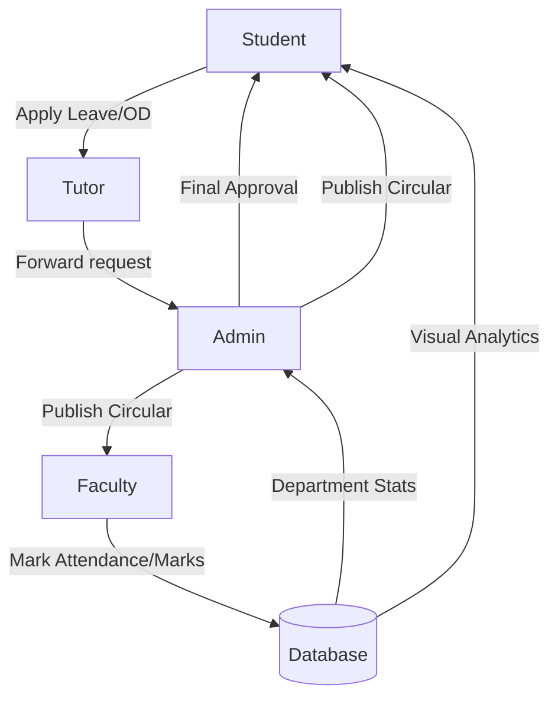

# 🌐 ACE-HOSUR Cyber Security Department Web Portal


A robust, enterprise-grade educational management system specifically tailored for the **Department of Cyber Security** at **Adhiyamaan College of Engineering (ACE-HOSUR)**. This portal bridges the gap between students, faculty, and administration through a unified, high-performance web interface.

---

## 🚀 Key Modules & Features

### 👤 Role-Based Dashboards
- 🛡️ **Admin**: High-level departmental overview, user management, and centralized approvals.
- 👨‍🏫 **Faculty**: Personal classroom management, marks entry, resource sharing, and attendance tracking.
- 🎓 **Student**: Comprehensive profile, attendance analytics, assignment submission, and performance tracking.
- 🤝 **Tutor (Class In-charge)**: Detailed oversight of their specific batch/section, mentoring students, and leave forwarding.

### 📅 Academic Operations
- **Timetable & Scheduling**: Dynamic timetable generation and visualization for students and faculty.
- **Attendance 2.0**: Intelligent attendance calculation excluding holidays and Sundays. Classifies OD (On-Duty) as present and Approved Leaves as absent (for calculation purposes).
- **Exam Center**: Management of Internal Assessment (IA) marks, Model Exam scores, and consolidated mark sheets.

### 📋 Leave & OD Portal
- **Smart Approval Workflow**: Multi-tier approval system (Tutor -> Admin).
- **Casual Leave Logic**: Automated check for ≥ 80% attendance requirement before applying.
- **On-Duty (OD) Tracking**: Place and reason tracking for academic, sports, or symposium events.

### 📚 Learning Management (LMS)
- **Unit-wise Notes**: Upload and download resources organized by syllabus units.
- **Digital Assignments**: Deadline-tracked submissions with grading capabilities and feedback loops.

### 📢 Communication & Welfare
- **Targeted Circulars**: Official notices filtered by role (All/Faculty/Students).
- **Grievance Cell**: Secure channel for students to report issues directly to Tutors or Admin.
- **Lost & Found**: Community-driven item recovery system.
- **Feedback System**: End-of-semester faculty performance evaluations.

---

## 🛠️ Technology Stack

| Layer | Technologies |
| :--- | :--- |
| **Frontend** | React 18, Vite, TypeScript, Tailwind CSS, Shadcn/UI |
| **State Management** | React Context API |
| **Backend** | Node.js, Express.js |
| **Database** | MySQL (with optimized connection pooling) |
| **Authentication** | JWT (JSON Web Tokens) with secure password hashing |
| **File Handling** | Multer (local disk storage) |

---

## 🔄 Core Workflow



---

## ⚙️ Development Setup

### Prerequisites
- Node.js (v18+)
- MySQL Server (v8.0+)
- Bun or NPM (Bun is recommended for performance)

### Installation Steps

1. **Clone & Install**
   ```sh
   git clone https://github.com/karthik-cyberexpert/cyber_web_portal.git
   cd cyber_web_portal
   npm install
   ```

2. **Backend Configuration**
   Navigate to the `server/` directory and create a `.env` file:
   ```env
   DB_HOST=localhost
   DB_USER=your_db_user
   DB_PASSWORD=your_db_password
   DB_NAME=Cyber_Dept_Portal
   JWT_SECRET=your_jwt_secret
   PORT=5000
   ```

3. **Database Setup**
   Execute the consolidated schema file in your MySQL environment:
   ```sh
   mysql -u root -p < schema/final_schema.sql
   ```

4. **Run Application**
   ```sh
   # Frontend (from root)
   npm run dev
   
   # Backend (from server directory)
   npm run dev
   ```

---

## 📄 Database Schema
The entire database structure is defined in [final_schema.sql](file:///C:/Users/Admin/Desktop/orchids-edu-bloom-2/schema/final_schema.sql). It contains 30+ tables with optimized constraints, supporting everything from basic user profiles to complex academic trends and feedback responses.

---

## 🛡️ Maintainer
**Cyber Security Department**  
*Adhiyamaan College of Engineering (ACE-HOSUR)*

Designed for excellence in departmental management. 🚀
